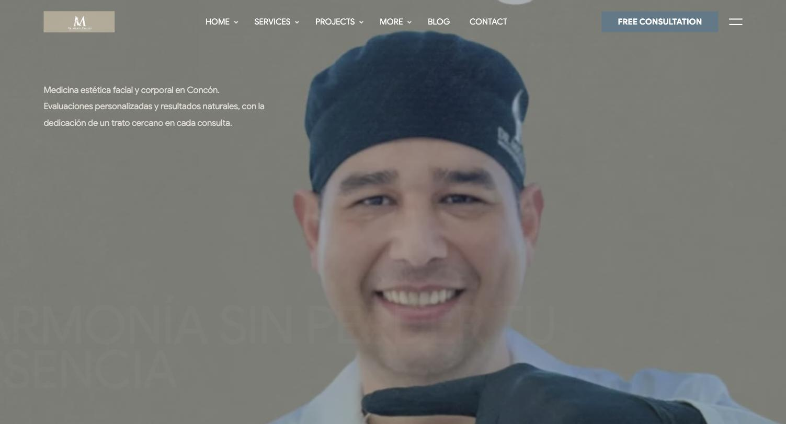
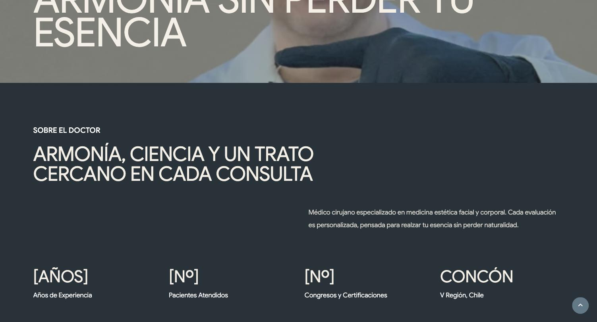

# Dr. Miguel Paredes — Sitio Web

Sitio para el Dr. Miguel Paredes, médico especialista en medicina estética
facial y corporal en Concón, V Región, Chile.

> **Nota sobre este repo:** el sitio se construye sobre **Intrio**, un
> template comprado (Designesia / ThemeForest). Por licencia, el código
> fuente completo del template **no se redistribuye aquí** — este
> repositorio documenta el proyecto: la dirección de diseño, el contenido,
> y nuestros propios archivos (overrides de color, imágenes de marca). El
> archivo fuente del template vive solo localmente.

## Estado actual

Trabajando sobre la variante de homepage **`index-2.html`** de Intrio.
Estructura y navegación del template sin modificar — solo se actualizaron
colores, textos e imágenes con contenido real del Dr. Paredes.

### Capturas

## Dirección de diseño — "Costa Serena"

Paleta cálida (sand/ivory) con acento azul-grisáceo, tipografía original
de Intrio (Google Sans) sin modificar.

**Referentes elegidos** (en orden de preferencia):

1. [Shafer Clinic](https://www.shaferplasticsurgery.com/) — blanco
   minimalista, mucho aire. El acento azul (`#5D7A88`) está extraído
   directo de su CSS renderizado, no adivinado.
2. [Clínica Lo Arcaya](https://clinicaloarcaya.cl/implante-capilar/) —
   precios reales visibles, CTA de agenda fuerte, widget de WhatsApp
   flotante.
3. [Aesthetics Geneva](https://www.aesthetics-ge.ch/) — ultra minimalista,
   wordmark serif como hero, botón de booking circular.

### Tokens de color

| Variable | Valor | Uso |
|---|---|---|
| `--primary-color` | `#5D7A88` | Acento (botones, links, iconos) — azul de Shafer |
| `--secondary-color` | `#D6DFE2` | Acento claro |
| `--bg-default` | `#F5F0E6` | Fondo cálido (sand) |
| `--bg-dark-1` | `#26323A` | Secciones oscuras (gris-azulado, no verde) |

Ver [`css/costaserena-theme.css`](css/costaserena-theme.css) y
[`css/colors/scheme-costaserena.css`](css/colors/scheme-costaserena.css) —
estos archivos son nuestros, se cargan como overrides sobre el CSS del
template sin tocar sus archivos originales.

## Contenido

- **Tratamientos:** Ginecomastia, Plasmage, Estética Facial, Estética
  Corporal, Perfiloplastia, Antienvejecimiento
- **Testimonios:** citas reales tomadas de comentarios públicos en
  Instagram (@dr.miguelparedes_)
- **Imágenes:** fotos reales del Dr. Paredes recortadas desde su
  Instagram (ver `reference-images/`) — pendiente reemplazar por
  fotografía profesional en resolución completa

## Pendiente

- [ ] Fotografía profesional (perfil, clínica, tratamientos) — las
      actuales son capturas de Instagram, resolución limitada
- [ ] Sistema de agenda real (Cal.com u otro) — hoy todo el CTA depende
      de WhatsApp/DM manual
- [ ] Datos reales: años de experiencia, N° de pacientes, email,
      teléfono (marcados como `[PENDIENTE]` en el sitio)
- [ ] Decidir si se actualiza el resto de páginas del template
      (`services.html`, `about.html`, `contact.html`, etc.) con el mismo
      criterio
- [ ] Traducir el menú de navegación (hoy en inglés, intacto por pedido
      explícito mientras se define el resto)

## Licencia

El template base (Intrio) es propiedad de Designesia, con licencia
comprada para este proyecto. El contenido, textos, dirección de diseño y
overrides de este repositorio son del proyecto del Dr. Miguel Paredes.
